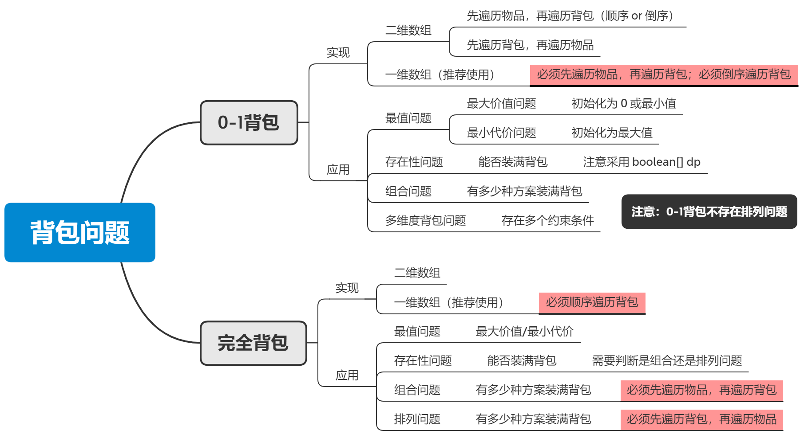

# 动态规划

## 1. 背包问题



背包问题一般较为复杂，需要考虑的情况很多。==因此，在代码书写时一定要按照动态规划五部曲写注释，否则自己会晕。==

> 动态规划的五部曲：
>
> 1. 确定`dp`数组以及下标的含义。
> 2. 确定递推公式（状态转移方程）。
> 3. `dp`数组如何初始化。
> 4. 确定遍历顺序。
> 5. 举例推导`dp`数组，打印`dp`数组，排查错误。

因此，对于最基本的实现方式，二维数组和一维数组的代码一定要熟练（**约定：默认使用一维数组实现**）；在此基础上，进一步考虑：

- 该问题是 $0-1$ 背包问题，还是完全背包问题？
- 背包容量的遍历顺序是顺序还是倒序？
- 先遍历物品，还是先遍历背包容量？

### 1.1. 0-1 背包问题

#### 1.1.1. 最后一块石头的重量Ⅱ

**题目 $1049$ 最后一块石头的重量Ⅱ**：有一堆石头，用整数数组`stones`表示。其中`stones[i]`表示第`i`块石头的重量。每一回合，从中选出任意两块石头，然后将它们一起粉碎。假设石头的重量分别为`x`和`y`，且`x <= y`。那么粉碎的可能结果如下：

- 如果`x == y`，那么两块石头都会被完全粉碎；
- 如果`x != y`，那么重量为`x`的石头将会完全粉碎，而重量为`y`的石头新重量为`y-x`。

最后，最多只会剩下一块石头。返回此石头最小的可能重量。如果没有石头剩下，就返回`0`。

```markdown
# 最值问题：
- 先遍历物品，再遍历背包。
- 倒序遍历背包。
```

```java
class Solution {
    public int lastStoneWeightII(int[] stones) {
        // 计算总重量
        int sum = 0;
        for (int i = 0; i < stones.length; i++) {
            sum += stones[i];
        }

        int capacity = sum / 2;
        // dp[j] 表示容量为 j 的背包能装的最大重量
        int[] dp = new int[capacity + 1];

        // 初始化：均为零

        // 先遍历物品，再遍历背包
        for (int i = 0; i < stones.length; i++) {
            // 倒序遍历背包
            for (int j = capacity; j >= stones[i]; j--) {
                dp[j] = Math.max(dp[j], dp[j - stones[i]] + stones[i]);
            }
        }
        return sum - 2 * dp[capacity];
    }
}
```

#### 1.1.2. 分割等和子集（hot100）

**题目 $416$ 分割等和子集**：给你一个只包含正整数的非空数组`nums`。请你判断是否可以将这个数组分割成两个子集，使得两个子集的元素和相等。

```markdown
# 存在性问题：
- 构建 boolean[] dp 数组。
- 先遍历物品，再遍历背包。
- 倒序遍历背包。
```

```java
class Solution {
    public boolean canPartition(int[] nums) {
        // 求总和
        int sum = 0;
        for (int i = 0; i < nums.length; i++) {
            sum += nums[i];
        }
        if (sum % 2 != 0) return false;

        int capacity = sum / 2;
        // dp[j] 表示容量为 j 的背包能否被装满
        boolean[] dp = new boolean[capacity + 1];

        // 初始化：
        dp[0] = true;

        // 先遍历物品，再遍历背包
        for (int i = 0; i < nums.length; i++) {
            // 倒序遍历背包
            for (int j = capacity; j >= nums[i]; j--) {
                dp[j] = dp[j] || dp[j - nums[i]];
            }
        }
        return dp[capacity];
    }
}
```

#### 1.1.3. 目标和

**题目 $494$ 目标和**：给你一个非负整数数组`nums`和一个整数`target`。向数组中的每个整数前添加`+`或`-`，然后串联起所有整数，可以构造一个表达式：例如`nums = [2, 1]`，可以在`2`之前添加`+`，在`1`之前添加`-`，然后串联起来得到表达式`+2-1`。返回可以通过上述方法构造的、运算结果等于`target`的不同表达式的数目。

```markdown
# 组合问题：
- 先遍历物品，再遍历背包。
- 倒序遍历背包。
```

```java
class Solution {
    public int findTargetSumWays(int[] nums, int target) {
        // 求总和
        int sum = 0;
        for (int i = 0; i < nums.length; i++) {
            sum += nums[i];
        }
        int capacity = (sum + target) / 2;  // 正数总和
        if (capacity < 0) return 0;  // 特殊情况1
        if ((sum + target) % 2 != 0) return 0;  // 特殊情况2

        // dp[j] 表示装满容量为 j 的背包有多少种方案
        int[] dp = new int[capacity + 1];

        // 初始化：装满容量为 0 的背包有 1 种方案
        dp[0] = 1;

        // 先遍历物品，再遍历背包
        for (int i = 0; i < nums.length; i++) {
            // 倒序遍历背包
            for (int j = capacity; j >= nums[i]; j--) {
                dp[j] = dp[j] + dp[j - nums[i]];
            }
        }
        return dp[capacity];
    }
}
```

### 1.2. 完全背包问题

#### 1.2.1. 零钱兑换（hot100）

**问题 $322$ 零钱兑换**：给你一个整数数组`coins`，表示不同面额的硬币；以及一个整数`amount`，表示总金额。计算并返回可以凑成总金额所需的最少的硬币个数。如果没有任何一种硬币组合能组成总金额，返回`-1`。你可以认为每种硬币的数量是无限的。

```markdown
# 最值问题——组合问题：
- 先遍历物品，再遍历背包。
- 顺序遍历背包。
```

```java
class Solution {
    public int coinChange(int[] coins, int amount) {
        if (amount == 0) return 0;
        // dp[j] 表示装满容量为 j 的背包所需的最小硬币个数
        int[] dp = new int[amount + 1];

        // 初始化：由于求最小值，因此初始化为最大值
        for (int j = 1; j <= amount; j++) {
            dp[j] = Integer.MAX_VALUE;
        }

        // 先遍历物品，再遍历背包
        for (int i = 0; i < coins.length; i++) {
            // 顺序遍历
            for (int j = coins[i]; j <= amount; j++) {
                // 需要判断背包能否被装满
                if (dp[j - coins[i]] != Integer.MAX_VALUE) {
                    dp[j] = Math.min(dp[j], dp[j - coins[i]] + 1);
                }
            }
        }
        return dp[amount] == Integer.MAX_VALUE ? -1 : dp[amount];
    }
}
```

#### 1.2.2. 完全平方数（hot100）

**题目 $279$ 完全平方数**：给你一个整数`n`，返回和为`n`的完全平方数的最少数量。

```markdown
# 最值问题——组合问题：
- 先遍历物品，再遍历背包。
- 顺序遍历背包。
- n = 1 的特殊情况。
```

```java
class Solution {
    public int numSquares(int n) {
        // dp[j] 表示装满容量为 j 的背包的最小价值
        int[] dp = new int[n + 1];

        // 初始化：由于求最小价值，因此全部初始化为最大值（除了 dp[0] = 0）
        for (int j = 1; j <= n; j++) {
            dp[j] = Integer.MAX_VALUE;
        }

        // 先遍历物品，再遍历背包（顺序遍历背包）
        // i <= n / 2 + 1 是为了防止 n = 1 的情况出错
        for (int i = 1; i <= (n / 2 + 1); i++) {
            for (int j = i * i; j <= n; j++) {
                // 对比上一题 零钱兑换，本题中背包一定能被装满，因此不需要条件判断
                dp[j] = Math.min(dp[j], dp[j - i * i] + 1);
            }
        }
        return dp[n];
    }
}
```

#### 1.2.3. 单词拆分（hot100）

**题目 $139$ 单词拆分**：给你一个字符串`s`和一个字符串列表`wordDict`作为字典。如果可以利用字典中出现的一个或多个单词拼接出`s`则返回`true`。注意：不要求字典中出现的单词全部都使用，并且单词可以重复使用。

```markdown
# 存在性问题——排列问题：
- 使用 boolean[] dp 数组。
- 先遍历背包，再遍历物品。
- 顺序遍历背包。
```

```java
class Solution {
    public boolean wordBreak(String s, List<String> wordDict) {
        // dp[j] 表示长度为 j 的子串能否由字典中的单词拼接而成
        boolean[] dp = new boolean[s.length() + 1];

        // 初始化
        dp[0] = true;  // 长度为 0 的子串能被字典中的单词拼接而成

        // 先遍历背包，再遍历物品
        for (int j = 0; j <= s.length(); j++) {
            for (String word : wordDict) {
                // 注意物品能放入背包的条件：
                // 1. 容量足够
                // 2. 单词匹配
                int len = word.length();
                if (len <= j && word.equals(s.substring(j - len, j))) {
                    dp[j] = dp[j] || dp[j - word.length()];  // 递推公式
                }
            }
        }
        return dp[s.length()];
    }
}
```

#### 1.2.4. 零钱兑换Ⅱ

**题目 $518$ 零钱兑换Ⅱ**：给你一个整数数组`coins`表示不同面额的硬币，另给一个整数`amount`表示总金额。请你计算并返回可以凑成总金额的硬币组合数。如果任何硬币组合都无法凑出总金额，返回`0`。假设每一种面额的硬币有无限个。 

```markdown
# 组合问题：
- 先遍历物品，再遍历背包。
- 顺序遍历背包。
```

```java
class Solution {
    public int change(int amount, int[] coins) {
        if (amount == 0) return 1;
        // dp[j] 表示装满容量为 j 的背包的组合数
        int[] dp = new int[amount + 1];

        // 初始化：装满容量为 0 的背包有一种方法
        dp[0] = 1;

        // 先遍历物品，再遍历背包
        for (int i = 0; i < coins.length; i++) {
            // 顺序遍历背包
            for (int j = coins[i]; j <= amount; j++) {
                dp[j] = dp[j] + dp[j - coins[i]];
            }
        }
        return dp[amount];
    }
}
```

#### 1.2.5. 组合总和Ⅳ

**题目 $377$ 组合总和Ⅳ**：给你一个由不同整数组成的数组`nums`，和一个目标整数`target`。请你从`nums`中找出并返回总和为`target`的元素组合的个数。

```markdown
# 排列问题：
- 先遍历背包，再遍历物品。
- 顺序遍历背包。
```

```java
class Solution {
    public int combinationSum4(int[] nums, int target) {
        // dp[j] 表示装满容量为 j 的背包的不同排列数
        int[] dp = new int[target + 1];

        // 初始化：装满容量为 0 的背包有 1 种方法
        dp[0] = 1;

        // 先遍历背包，再遍历物品；顺序遍历背包
        for (int j = 1; j <= target; j++) {
            for (int i = 0; i < nums.length; i++) {
                if (nums[i] <= j) {
                    dp[j] = dp[j] + dp[j - nums[i]];
                }
            }
        }
        return dp[target];
    }
}
```

## 2. 子序列问题

### 2.1. 一维子序列问题

一维子序列问题：求解仅涉及一个数组或一个序列的子数组（或子序列），而不是比较两个数组或序列之间的子序列问题。

> 注意点：
>
> - 根据问题的具体要求，动态规划`dp`数组可以是一维，也可以是二维。取决于每个位置有多少种状态。
> - `dp`数组的长度不需要进行“加一”处理。
> - 针对**连续、非连续子序列**问题，`dp`数组的含义均定义为“以下标为`i`的元素结尾的 $\dots$”。

#### 2.1.1. 最大子数组和（hot100, 1）

**题目 $53$​ 最大子数组和**：给你一个整数数组`nums`，请你找出一个具有最大和的连续子数组（子数组最少包含一个元素），返回其最大和。子数组是数组中的一个连续部分。

```markdown
# 注意点：
- dp 数组含义为以下标为 i 的元素结尾，而不是到下标为 i 的元素为止；结果需要随时更新。
```

```java
// 时间复杂度 O(n)；空间复杂度 O(n)
// n - 数组长度
class Solution {
    public int maxSubArray(int[] nums) {
        // dp[i] 表示以下标为 i 的元素结尾的最大连续子数组和 (0 <= i <= nums.length - 1)
        int[] dp = new int[nums.length];

        // 初始化：以下标为 0 的元素结尾的最大连续子数组和为 nums[0]
        dp[0] = nums[0];

        int res = nums[0];
        for (int i = 1; i < nums.length; i++) {
            // 递推公式
            dp[i] = Math.max(dp[i - 1] + nums[i], nums[i]);
            if (dp[i] > res) res = dp[i];
        }
        return res;
    }
}
```

#### 2.1.2. 乘积最大子数组（hot100）

**题目 $152$ 乘积最大子数组**：给你一个整数数组`nums`，请你找出数组中乘积最大的非空连续子数组（该子数组中至少包含一个数字），并返回该子数组所对应的乘积。测试用例的答案是一个 $32$ 位整数。

```markdown
# 注意点：
- dp 数组含义为以下标为 i 的元素结尾，而不是到下标为 i 的元素为止；结果需要随时更新。
- 由于乘积存在负负得正的情况，因此每一个位置需要维护两种状态：乘积最大值、乘积最小值。
```

```java
class Solution {
    public int maxProduct(int[] nums) {
        // dp[i][0] 表示以下标为 i 的元素结尾的子数组最大乘积
        // dp[i][1] 表示以下标为 i 的元素结尾的子数组最小乘积
        int[][] dp = new int[nums.length][2];

        // 初始化：以下标为 0 的元素结尾的子数组最大乘积和最小乘积均为 nums[0]
        dp[0][0] = nums[0];
        dp[0][1] = nums[0];

        int res = nums[0];
        for (int i = 1; i < nums.length; i++) {
            dp[i][0] = Math.max(nums[i],
                Math.max(dp[i - 1][0] * nums[i], dp[i - 1][1] * nums[i]));
            dp[i][1] = Math.min(nums[i], 
                Math.min(dp[i - 1][0] * nums[i], dp[i - 1][1] * nums[i]));
            if (dp[i][0] > res) res = dp[i][0];
        }
        return res;
    }
}
```

#### 2.1.3. 最长连续递增子序列

**题目 $674$ 最长连续递增子序列**：给定一个未经排序的整数数组，找到最长且连续递增的子序列，并返回该序列的长度。

```markdown
# 注意点：
- dp 数组含义为以下标为 i 的元素结尾，而不是到下标为 i 的元素为止；结果需要随时更新。
```

```java
class Solution {
    public int findLengthOfLCIS(int[] nums) {
        // dp[i] 表示以下标为 i 的元素结尾的最长递增子序列长度 (0 <= i <= nums.length - 1)
        int[] dp = new int[nums.length];

        // 初始化：以下标为 0 的元素结尾的最长递增子序列长度为 1
        dp[0] = 1;

        int res = 1;
        for (int i = 1; i < nums.length; i++) {
            if (nums[i] > nums[i - 1]) dp[i] = dp[i - 1] + 1;
            else dp[i] = 1;
            if (dp[i] > res) res = dp[i];
        }
        return res;
    }
}
```

#### 2.1.4. 最长递增子序列（hot100, 2）

**题目 $300$ 最长递增子序列**：给你一个整数数组`nums`，找到其中最长严格递增子序列的长度。子序列是由数组派生而来的序列，删除（不删除）数组中的元素而不改变其余元素的顺序。`[3,6,2,7]`是数组`[0,3,1,6,2,2,7]`的子序列。

```markdown
# 注意点：
- dp 数组含义为以下标为 i 的元素结尾，而不是到下标为 i 的元素为止；结果需要随时更新。
- 由于本题中的子序列不要求连续，因此需要用一个循环遍历之前所有的情况。
```

```java
// 时间复杂度 O(n)；空间复杂度 O(n)
// n - 数组长度
class Solution {
    public int lengthOfLIS(int[] nums) {
        // dp[i] 表示以索引为 i 的元素结尾的最长递增子序列长度
        int[] dp = new int[nums.length];

        // 初始化
        dp[0] = 1;

        // 遍历顺序
        int maxLen = 1;
        for (int i = 1; i < nums.length; i++) {
            int tmpLen = 1;
            for (int j = 0; j < i; j++) {
                if (nums[i] > nums[j]) {
                    tmpLen = Math.max(tmpLen, dp[j] + 1);
                }
            }
            dp[i] = tmpLen;
            maxLen = Math.max(maxLen, dp[i]);
        }
        return maxLen;
    }
}
```

#### 2.1.5. 最长递增子序列的个数

**题目 $673$​ 最长递增子序列的个数**：给定一个未排序的整数数组`nums`，返回最长递增子序列的个数。最长递增子序列非连续，但必须是严格递增的。

```markdown
# 注意点：
- dp 数组含义为以下标为 i 的元素结尾，而不是到下标为 i 的元素为止。
- 注意：在遍历过程中更新“最长递增子序列的个数”的逻辑。
```

```java
class Solution {
    public int findNumberOfLIS(int[] nums) {
        // dpLen[i] 表示以下标 i 结尾的最长递增子序列长度
        // dpCount[i] 表示以下标 i 结尾的最长递增子序列个数
        int[] dpLen = new int[nums.length];
        int[] dpCount = new int[nums.length];
        
        // 初始化
        dpLen[0] = 1;
        dpCount[0] = 1;

        int maxLen = 1;
        for (int i = 1; i < dpLen.length; i++) {
            int tmpLen = 1;
            int tmpCount = 1;
            for (int j = 0; j < i; j++) {
                if (nums[i] > nums[j]) {
                    if (dpLen[j] + 1 > tmpLen) {
                        // 情况一：发现了更长的递增子序列，则重置 count
                        tmpLen = dpLen[j] + 1;
                        tmpCount = dpCount[j];
                    } else if (dpLen[j] + 1 == tmpLen) {
                        // 情况二：发现了相等长度的递增子序列，则累加 count
                        tmpLen = dpLen[j] + 1;
                        tmpCount += dpCount[j];
                    }
                }
            }
            dpLen[i] = tmpLen;
            dpCount[i] = tmpCount;
            maxLen = Math.max(maxLen, dpLen[i]);
        }
        
        // 遍历统计结果
        int res = 0;
        for (int i = 0; i < dpLen.length; i++) {
            if (dpLen[i] == maxLen) {
                res += dpCount[i];
            }
        }
        return res;
    }
}
```

### 2.2. 二维子序列问题

二维子序列问题：求解涉及两个数组或序列之间的子序列问题。

> 注意点：
>
> - 由于涉及两个数组（或序列），因此动态规划数组`dp`一定是二维的。
> - `dp`数组的长度需要进行“加一”处理，可以简化初始化过程。
> - 针对**连续子序列**问题，`dp`数组的含义定义为“以下标`i - 1,j - 1`的元素结尾的 $\dots$”；针对**非连续子序列**问题，`dp`数组的含义定义为“到下标`i - 1,j - 1`的元素为止的 $\dots$”。

#### 2.2.1. 最长重复子数组

**题目 $718$ 最长重复子数组**：给两个整数数组`nums1`和`nums2`，返回两个数组中公共的、长度最长的子数组的长度。注意：子数组需连续。

```markdown
# 注意点：
- dp 数组含义为以下标为 i-1,j-1 的元素结尾，而不是到下标为 i-1,j-1 的元素为止；结果需要随时更新。
```

```java
class Solution {
    public int findLength(int[] nums1, int[] nums2) {
        // dp[i][j] 表示：
        // 以下标为 i - 1 的元素结尾，下标为 j - 1 的元素结尾的公共最长子数组长度
        // 1 <= i <= nums1.length, 1 <= j <= nums2.length
        int[][] dp = new int[nums1.length + 1][nums2.length + 1];

        // 初始化：第一行、第一列均为 0
        
        int res = 0;
        for (int i = 1; i <= nums1.length; i++) {
            for (int j = 1; j <= nums2.length; j++) {
                if (nums1[i - 1] == nums2[j - 1]) {
                    dp[i][j] = dp[i - 1][j - 1] + 1;
                }
                if (dp[i][j] > res) res = dp[i][j];
            }
        }
        return res;
    }
}
```

#### 2.2.2. 最长公共子序列（hot100, 2）

**题目 $1143$ 最长公共子序列**：给定两个字符串`text1`和`text2`，返回这两个字符串的最长公共子序列的长度。如果不存在公共子序列，返回`0`。注意：公共子序列可以不连续。

```markdown
# 注意点：
- dp 数组含义为到下标为 i-1,j-1 的元素为止，而不是以下标为 i-1,j-1 的元素结尾；结果在 dp 数组右下角。
```

```java
// 时间复杂度 O(n^2)；空间复杂度 O(n^2)
// n - 数组长度
class Solution {
    public int longestCommonSubsequence(String text1, String text2) {
        // dp[i][j] 表示：
        // 到下标 i-1,j-1 的元素为止的最长公共子序列长度
        // 1 <= i <= text1.length(), 1 <= j <= text2.length()
        int[][] dp = new int[text1.length() + 1][text2.length() + 1];

        // 初始化：第一行、第一列均为 0
        
        // 遍历顺序
        for (int i = 1; i <= text1.length(); i++) {
            for (int j = 1; j <= text2.length(); j++) {
                if (text1.charAt(i - 1) == text2.charAt(j - 1)) {
                    dp[i][j] = dp[i - 1][j - 1] + 1;
                } else {
                    dp[i][j] = Math.max(dp[i - 1][j], dp[i][j - 1]);
                }
            }
        }
        return dp[text1.length()][text2.length()];
    }
}
```

#### 2.2.3. 不相交的线

**题目 $1035$ 不相交的线**：在两条独立的水平线上按给定的顺序写下`nums1`和`nums2`中的整数。现在，可以绘制一些连接两个数字`nums1[i]`和`nums2[j]`的直线，这些直线需要同时满足：`nums1[i] == nums2[j]`且绘制的直线不与任何其他连线（非水平线）相交。请注意，连线即使在端点也不能相交：每个数字只能属于一条连线。以这种方法绘制线条，并返回可以绘制的最大连线数。

```markdown
# 注意点：
- dp 数组含义为到下标为 i-1,j-1 的元素为止，而不是以下标为 i-1,j-1 的元素结尾；结果在 dp 数组右下角。
```

```java
class Solution {
    public int maxUncrossedLines(int[] nums1, int[] nums2) {
        // dp[i][j] 表示：
        // 到下标为 i - 1, j - 1 元素为止的最大连线数
        // 1 <= i <= nums1.length, 1 <= j <= nums2.length
        int[][] dp = new int[nums1.length + 1][nums2.length + 1];

        // 初始化：第一行、第一列均为 0

        for (int i = 1; i <= nums1.length; i++) {
            for (int j = 1; j <= nums2.length; j++) {
                if (nums1[i - 1] == nums2[j - 1]) dp[i][j] = dp[i - 1][j - 1] + 1;
                else {
                    dp[i][j] = Math.max(dp[i][j - 1], dp[i - 1][j]);
                }
            }
        }
        return dp[nums1.length][nums2.length];
    }
}
```

#### 2.2.4. 两个字符串的删除操作

**题目 $583$ 两个字符串的删除操作**：给定两个单词`word1`和`word2`，返回使得`word1`和`word2`相同所需的最小步数。每步可以删除任意一个字符串中的一个字符。

```markdown
# 注意点：
- dp 数组含义为到下标为 i-1,j-1 的元素为止，而不是以下标为 i-1,j-1 的元素结尾；结果在 dp 数组右下角。
```

```java
class Solution {
    public int minDistance(String word1, String word2) {
        // dp[i][j] 表示：
        // 到以下标为 i-1,j-1 的元素为止的最小步数
        // 1 <= i <= word.length(), 1 <= j <= word.length()
        int[][] dp = new int[word1.length() + 1][word2.length() + 1];

        // 初始化：
        for (int i = 1; i <= word1.length(); i++) {
            dp[i][0] = i;
        }
        for (int j = 1; j <= word2.length(); j++) {
            dp[0][j] = j;
        }

        for (int i = 1; i <= word1.length(); i++) {
            for (int j = 1; j <= word2.length(); j++) {
                if (word1.charAt(i - 1) == word2.charAt(j - 1)) {
                    dp[i][j] = dp[i - 1][j - 1];
                } else {
                    dp[i][j] = Math.min(dp[i - 1][j - 1] + 2, 
                        Math.min(dp[i][j - 1] + 1, dp[i - 1][j] + 1));
                }
            }
        }
        return dp[word1.length()][word2.length()];
    }
}
```

#### 2.2.5. 编辑距离（hot100, 2）

**题目 $72$ 编辑距离**：给你两个单词`word1`和`word2`，请返回将`word1`转换成`word2`所使用的最少操作数。你可以对一个单词进行如下三种操作：插入一个字符；删除一个字符；替换一个字符。

```markdown
# 注意点：
- dp 数组含义为到下标为 i-1,j-1 的元素为止，而不是以下标为 i-1,j-1 的元素结尾；结果在 dp 数组右下角。
```

```java
// 时间复杂度 O(n*m)；空间复杂度 O(n*m)
// n - word1.length(); m - word2.length()
class Solution {
    public int minDistance(String word1, String word2) {
        // dp[i][j] 表示：
        // 到以下标为 i-1,j-1 的元素为止的最少操作数
        // 1 <= i <= word1.length(), 1 <= j <= word2.length()
        int[][] dp = new int[word1.length() + 1][word2.length() + 1];

        // 初始化：
        for (int i = 1; i <= word1.length(); i++) {
            dp[i][0] = i;
        }
        for (int j = 1; j <= word2.length(); j++) {
            dp[0][j] = j;
        }

        for (int i = 1; i <= word1.length(); i++) {
            for (int j = 1; j <= word2.length(); j++) {
                if (word1.charAt(i - 1) == word2.charAt(j - 1)) {
                    dp[i][j] = dp[i - 1][j - 1];
                } else {
                    dp[i][j] = Math.min(dp[i - 1][j - 1] + 1,
                        Math.min(dp[i - 1][j] + 1, dp[i][j - 1] + 1));
                }
            }
        }
        return dp[word1.length()][word2.length()];
    }
}
```

### 2.3. 回文子序列问题

回文子序列属于特殊的二维子序列问题。

> 注意点：
>
> - 由于回文的特殊性质，动态规划数组`dp`是二维的，两个维度分别表示回文的头和尾。
> - `dp`数组的长度不需要进行“加一”处理。
> - 针对**连续子序列**问题，`dp`数组的含义定义为“以下标为`i`的元素开头，以下标为` j`的元素结尾的 $\dots$”；针对**非连续子序列**问题，`dp`数组的含义定义为“下标在`i ~ j`范围内的 $\dots$”。
> - 遍历顺序：**从下往上**，从左往右遍历。

#### 2.3.1. 回文子串

**题目 $647$ 回文子串**：给你一个字符串`s`，请你统计并返回这个字符串中回文子串的数目。子字符串是字符串中的由连续字符组成的一个序列。

```markdown
# 注意点：
- 定义二维 boolean 数组。
- dp 数组含义为以下标为 i 的元素开头，下标为 j 的元素结尾的子串是否为回文子串；而不是 i~j 范围内。
```

```java
class Solution {
    public int countSubstrings(String s) {
        // dp[i][j] 表示：
        // 从下标为 i 的元素开始，到下标为 j 的元素结束的子串是否是回文串
        // 0 <= i <= j <= s.length() - 1
        boolean[][] dp = new boolean[s.length()][s.length()];

        // 初始化：全部为 false

        // 遍历顺序：从下往上，从左往右
        int count = 0;
        for (int i = s.length() - 1; i >= 0; i--) {
            for (int j = i; j <= s.length() - 1; j++) {
                if (s.charAt(i) == s.charAt(j)) {
                    if (j - i <= 1) dp[i][j] = true;
                    else dp[i][j] = dp[i + 1][j - 1];
                }
                if (dp[i][j] == true) count++;
            }
        }
        return count;
    }
}
```

#### 2.3.2. 最长回文子串（hot100, 1）

**题目 $5$ 最长回文子串**：给你一个字符串`s`，找到`s`中最长的回文子串。注意：回文子串是连续的。

```markdown
# 注意点：
- 定义二维 boolean 数组。
- dp 数组含义为以下标为 i 的元素开头，下标为 j 的元素结尾的子串是否为回文子串；而不是 i~j 范围内。
```

```java
// 时间复杂度 O(n^2)；空间复杂度 O(n^2)
// n - 字符串长度
class Solution {
    public String longestPalindrome(String s) {
        // dp[i][j] 表示：
        // 以下标 i 的元素开始，下标 j 的元素结尾的子串是否为回文串
        // 0 <= i <= j <= s.length() - 1
        boolean[][] dp = new boolean[s.length()][s.length()];

        // 初始化：全部为 false

        // 遍历顺序：从下往上，从左往右
        int maxLen = 0;
        String maxString = "";
        for (int i = s.length() - 1; i >= 0; i--) {
            for (int j = i; j <= s.length() - 1; j++) {
                if (s.charAt(i) == s.charAt(j)) {
                    if (j - i <= 1) dp[i][j] = true;
                    else dp[i][j] = dp[i + 1][j - 1];
                }
                if (dp[i][j] == true && maxLen < j - i + 1) {
                    maxString = s.substring(i, j + 1);
                    maxLen = j - i + 1;
                }
            }
        }
        return maxString;
    }
}
```

#### 2.3.3. 最长回文子序列

**题目 $516$ 最长回文子序列**：给你一个字符串`s`，找出其中最长的回文子序列，并返回该序列的长度。子序列定义为：不改变剩余字符顺序的情况下，删除某些字符或者不删除任何字符形成的一个序列。

```markdown
# 注意点：
- dp 数组含义为 i~j 范围内，而不是以下标为 i 的元素开头，下标为 j 的元素结尾。
```

```java
class Solution {
    public int longestPalindromeSubseq(String s) {
        // dp[i][j] 表示：
        // 在下标为 i 到 j 之间的最长回文子序列长度
        // 0 <= i <= j <= s.length() - 1
        int[][] dp = new int[s.length()][s.length()];

        // 初始化：全部为 0

        // 遍历顺序：从下往上，从左往右
        for (int i = s.length() - 1; i >= 0; i--) {
            for (int j = i; j <= s.length() - 1; j++) {
                if (s.charAt(i) == s.charAt(j)) {
                    if (j - i <= 1) dp[i][j] = j - i + 1;
                    else dp[i][j] = dp[i + 1][j - 1] + 2;
                } else {
                    dp[i][j] = Math.max(dp[i + 1][j], dp[i][j - 1]);
                }
            }
        }
        return dp[0][s.length() - 1];
    }
}
```

## 3. 买卖股票系列

> 这一系列题目的`dp`数组定义较为特殊，通常需要用二维数组来表示不同的状态：
>
> - `dp[i][0]`：表示第`i (0 <= i <= prices.length - 1)`天不持有股票能获得的最大利润。
> - `dp[i][1]`：表示第`i (0 <= i <= prices.length - 1)`天持有股票能获得的最大利润。

### 3.1. 买卖股票的最佳时机（hot100, 1）

**题目 $121$ 买卖股票的最佳时机**：给定一个数组`prices`，它的第`i`个元素`prices[i]`表示一支给定股票第`i`天的价格。你只能选择某一天买入这只股票，并选择在未来的某一个不同的日子卖出该股票。设计一个算法来计算你所能获取的最大利润。返回你可以从这笔交易中获取的最大利润。如果你不能获取任何利润，返回`0`。 

```markdown
# 注意点：
- 本题需要在递推公式中体现只能买卖一次股票。
```

```java
class Solution {
    public int maxProfit(int[] prices) {
        // dp[i][0] 表示第 i 天不持有股票的最大利润
        // dp[i][1] 表示第 i 天持有股票的最大利润
        // 0 <= i <= prices.length - 1
        int[][] dp = new int[prices.length][2];

        // 初始化：
        dp[0][0] = 0;
        dp[0][1] = -prices[0];

        for (int i = 1; i < prices.length; i++) {
            dp[i][0] = Math.max(dp[i - 1][0], dp[i - 1][1] + prices[i]);
            dp[i][1] = Math.max(dp[i - 1][1], -prices[i]);
        }
        return dp[prices.length - 1][0];
    }
}
```

### 3.2. 买卖股票的最佳时机Ⅱ

**题目 $122$ 买卖股票的最佳时机Ⅱ**：给你一个整数数组`prices`，其中`prices[i]`表示某支股票第`i`天的价格。在每一天，你可以决定是否购买、或出售股票。你在任何时候最多只能持有一股股票。你也可以先购买，然后在同一天出售。返回你能获得的最大利润。

```markdown
# 注意点：
- 本题需要在递推公式中体现可以多次买卖股票。
```

```java
class Solution {
    public int maxProfit(int[] prices) {
        // dp[i][0] 表示第 i 天不持有股票的最大利润
        // dp[i][1] 表示第 i 天持有股票的最大利润
        // 0 <= i <= prices.length - 1
        int[][] dp = new int[prices.length][2];

        // 初始化
        dp[0][0] = 0;
        dp[0][1] = -prices[0];

        for (int i = 1; i < prices.length; i++) {
            dp[i][0] = Math.max(dp[i - 1][0], dp[i - 1][1] + prices[i]);
            dp[i][1] = Math.max(dp[i - 1][1], dp[i - 1][0] - prices[i]);
        }
        return dp[prices.length - 1][0];
    }
}
```

### 3.3. 买卖股票的最佳时机含手续费

**题目 $714$ 买卖股票的最佳时机含手续费**：给定一个整数数组`prices`，其中`prices[i]`表示第`i`天的股票价格 ；整数`fee`代表了交易股票的手续费用。你可以无限次地完成交易，但是你每笔交易都需要付手续费。如果你已经购买了一个股票，在卖出它之前你就不能再继续购买股票了。返回获得利润的最大值。注意：这里的一笔交易指买入持有并卖出股票的整个过程，每笔交易你只需要为支付一次手续费。

```markdown
# 注意点：
- 本题需考虑手续费 fee 的扣减位置。
```

```java
class Solution {
    public int maxProfit(int[] prices, int fee) {
        // dp[i][0] 表示第 i 天持有股票的最大利润
        // dp[i][1] 表示第 i 天不持有股票的最大利润
        // 0 <= i <= prices.length - 1
        int[][] dp = new int[prices.length][2];

        // 初始化
        dp[0][0] = 0;
        dp[0][1] = -prices[0];

        for (int i = 1; i < prices.length; i++) {
            // 注意：fee 的扣减在 Math.max() 方法内
            dp[i][0] = Math.max(dp[i - 1][0], dp[i - 1][1] + prices[i] - fee);
            dp[i][1] = Math.max(dp[i - 1][1], dp[i - 1][0] - prices[i]);
        }
        return dp[prices.length - 1][0];
    }
}
```

### 3.4. 买卖股票的最佳时机Ⅲ

### 3.5. 买卖股票的最佳时机Ⅳ

## 4. 打家劫舍系列

### 4.1. 打家劫舍（hot100）

**题目 $198$ 打家劫舍**：你是一个专业的小偷，计划偷窃沿街的房屋。每间房内都藏有一定的现金，影响你偷窃的唯一制约因素就是相邻的房屋装有相互连通的防盗系统，如果两间相邻的房屋在同一晚上被小偷闯入，系统会自动报警。给定一个代表每个房屋存放金额的非负整数数组，计算你不触动警报装置的情况下，一夜之内能够偷窃到的最高金额。

```markdown
# 注意点：
- 当前状态与前一个和前两个状态的递推关系，类似 “70 爬楼梯”。
```

```java
class Solution {
    public int rob(int[] nums) {
        if (nums.length == 1) return nums[0];
        // dp[i] 表示：从下标 0-i 的房间能偷的最大金额
        // 0 <= i <= nums.length - 1
        int[] dp = new int[nums.length];

        // 初始化
        dp[0] = nums[0];
        dp[1] = Math.max(nums[0], nums[1]);

        for (int i = 2; i < nums.length; i++) {
            dp[i] = Math.max(dp[i - 1], dp[i - 2] + nums[i]);
        }
        return dp[nums.length - 1];
    }
}
```

### 4.2. 打家劫舍Ⅱ

**题目 $213$ 打家劫舍Ⅱ**：你是一个专业的小偷，计划偷窃沿街的房屋，每间房内都藏有一定的现金。这个地方所有的房屋都围成一圈，这意味着第一个房屋和最后一个房屋是紧挨着的。同时，相邻的房屋装有相互连通的防盗系统，如果两间相邻的房屋在同一晚上被小偷闯入，系统会自动报警。给定一个代表每个房屋存放金额的非负整数数组，计算你在不触动警报装置的情况下，今晚能够偷窃到的最高金额。

```markdown
# 注意点：
- 将环形问题转换为线性问题 “198 打家劫舍”。
```

```java
class Solution {
    public int rob(int[] nums) {
        if (nums.length == 1) return nums[0];
        // 特殊点在于第一间、最后一间房屋。因此，进行分类讨论：
        // 情况一：不考虑第一间房屋
        int[] nums1 = new int[nums.length - 1];
        for (int i = 0; i < nums1.length; i++) {
            nums1[i] = nums[i + 1];
        }
        // 情况二：不考虑最后一间房屋
        int[] nums2 = new int[nums.length - 1];
        for (int i = 0; i < nums2.length; i++) {
            nums2[i] = nums[i];
        }
        return Math.max(robLinear(nums1), robLinear(nums2));
    }

    public int robLinear(int[] nums) {
        if (nums.length == 1) return nums[0];
        // dp[i] 表示在下标为 0~i 的房屋中能偷窃的最大金额
        // 0 <= i <= nums.length - 1
        int[] dp = new int[nums.length];

        // 初始化：
        dp[0] = nums[0];
        dp[1] = Math.max(nums[0], nums[1]);

        for (int i = 2; i < nums.length; i++) {
            dp[i] = Math.max(dp[i - 1], dp[i - 2] + nums[i]);
        }
        return dp[nums.length - 1];
    }
}
```

### 4.3. 打家劫舍Ⅲ

**题目 $337$ 打家劫舍Ⅲ**：小偷又发现了一个新的可行窃的地区。这个地区只有一个入口，我们称之为`root`。除了`root`之外，每栋房子有且只有一个父房子与之相连。一番侦察之后，聪明的小偷意识到这个地方的所有房屋的排列类似于一棵二叉树。 如果两个直接相连的房子在同一天晚上被打劫，房屋将自动报警。给定二叉树的`root` 。返回在不触动警报的情况下，小偷能够盗取的最高金额。

## 5. 其他

### 5.1. 爬楼梯（hot100, 3）

**题目 $70$ 爬楼梯**：假设你正在爬楼梯。需要`n`阶你才能到达楼顶。每次你可以爬`1`或`2`个台阶。你有多少种不同的方法可以爬到楼顶呢？

```java
// 时间复杂度 O(n)；空间复杂度 O(n)
// n 题目给定值
class Solution {
    public int climbStairs(int n) {
        if (n == 1) return 1;
        // dp[i] 表示：
        // 到达第 i+1 阶台阶的不同方法数
        // 0 <= i <= n-1
        int[] dp = new int[n];

        // 初始化
        dp[0] = 1;
        dp[1] = 2;

        for (int i = 2; i < n; i++) {
            dp[i] = dp[i - 1] + dp[i - 2];
        }
        return dp[n - 1];
    }
}
```

### 5.2. 杨辉三角（hot100）

**题目 $118$ 杨辉三角**：给定一个非负整数`numRows`，生成杨辉三角的前`numRows`行。

```markdown
# 注意点：
- 本题较为特殊，dp 数组为 List 对象，且逐步添加。
```

```java
class Solution {
    public List<List<Integer>> generate(int numRows) {
        // dp.get(i).get(j) 含义
        // 下标为 i,j 的元素值
        List<List<Integer>> dp = new ArrayList<>();

        // 初始化：不需要
        
        for (int i = 0; i < numRows; i++) {
            List<Integer> tmp = new ArrayList<>();
            for (int j = 0; j < numRows; j++) {
                if (j == 0 || i == j) tmp.add(1);
                else if (i > j) {
                    tmp.add(dp.get(i - 1).get(j - 1) + dp.get(i - 1).get(j));
                }
            }
            dp.add(tmp);
        }
        return dp;
    }
}
```

### 5.3. 不同路径（hot100）

**题目 $62$ 不同路径**：一个机器人位于一个`m x n`网格的左上角，机器人每次只能向下或者向右移动一步。机器人试图达到网格的右下角。问总共有多少条不同的路径？

```java
class Solution {
    public int uniquePaths(int m, int n) {
        // dp[i][j] 表示：
        // 到达下标为 i,j 的网格的不同路径数量
        // 0 <= i <= m - 1, 0 <= j <= n - 1
        int[][] dp = new int[m][n];

        // 初始化：第一行、第一列全部为 1
        for (int i = 0; i < m; i++) {
            dp[i][0] = 1;
        }
        for (int j = 0; j < n; j++) {
            dp[0][j] = 1;
        }

        for (int i = 1; i < m; i++) {
            for (int j = 1; j < n; j++) {
                dp[i][j] = dp[i - 1][j] + dp[i][j - 1];
            }
        }
        return dp[m - 1][n - 1];
    }
}
```

### 5.4. 最小路径和（hot100）

**题目 $64$ 最小路径和**：给定一个包含非负整数的`m x n`网格`grid`，请找出一条从左上角到右下角的路径，使得路径上的数字总和为最小。每次只能向下或者向右移动一步。

```java
class Solution {
    public int minPathSum(int[][] grid) {
        // dp[i][j] 表示：
        // 到下标为 i,j 的位置最小的路经总和
        // 0 <= i <= grid.length - 1, 0 <= j <= grid[0].length - 1
        int[][] dp = new int[grid.length][grid[0].length];

        // 初始化
        dp[0][0] = grid[0][0];
        for (int i = 1; i < grid.length; i++) {
            dp[i][0] = grid[i][0] + dp[i - 1][0];
        }
        for (int j = 1; j < grid[0].length; j++) {
            dp[0][j] = grid[0][j] + dp[0][j - 1];
        }

        for (int i = 1; i < grid.length; i++) {
            for (int j = 1; j < grid[0].length; j++) {
                dp[i][j] = Math.min(dp[i - 1][j], dp[i][j - 1]) + grid[i][j];
            }
        }
        return dp[grid.length - 1][grid[0].length - 1];
    }
}
```
